<h1 align="center"><b>N E O B R I X</b></h1>

<p align="center"><i>A neo-brutalist desktop environment for Hyprland, powered by Quickshell.</i></p>

---

<p align="center">
  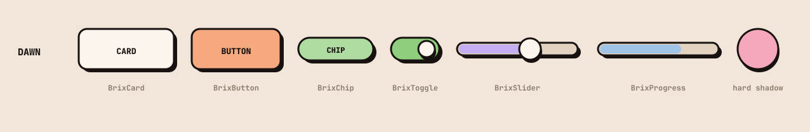
</p>

<p align="center">
  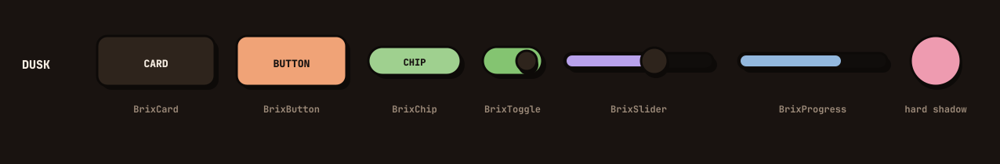
</p>

<p align="center">
  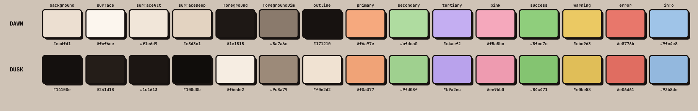
</p>

---

## Install

On CachyOS or Arch:

```bash
curl -fsSL https://raw.githubusercontent.com/asad-albadi/NeoBrix/main/install/bootstrap.sh | bash
```

Or read it first, which is the better habit with any `curl | bash`:

```bash
curl -fsSL https://raw.githubusercontent.com/asad-albadi/NeoBrix/main/install/bootstrap.sh -o neobrix-install.sh
less neobrix-install.sh
bash neobrix-install.sh
```

Both forms run the same file, and `bash` is required either way — the script is
bash, not POSIX `sh`.

That script is deliberately thin: it refuses to run as root, refuses a machine
without `pacman`, clones this repository to `~/Projects/neobrix`, and then hands
off to [`install/packages.sh`](install/packages.sh) and
[`install/deploy.sh`](install/deploy.sh), which do the real work and are worth
reading too. It installs the packages, links the configuration into `~/.config`,
installs and enables the systemd user units, generates the wallpapers and the
palette-derived themes, and themes Zen Browser if a profile exists.

| Flag | Effect |
|---|---|
| `--yes` | Non-interactive. Safe defaults, and **removes nothing**. |
| `--no-packages` | Skip `pacman`; only link configuration. |
| `--greeter` | Also stage the login screen. Asked about otherwise; never silent. |
| `--dir <path>` | Where to clone. Default `~/Projects/neobrix`, or `$NEOBRIX_DIR`. |
| `--uninstall` | Undo: restore backups, disable the units, report what it left. |
| `--help` | The list above. |

With the piped form, flags have to be handed past `bash` itself, or `bash` takes
them as its own:

```bash
curl -fsSL .../install/bootstrap.sh | bash -s -- --greeter --dir ~/src/neobrix
```

**Two things it will not do behind your back.**

*Another desktop already installed* — it looks for Noctalia, Caelestia,
end-4/dots-hyprland, ML4W, other Quickshell configs, and units that would fight
this shell (a second bar, a second notification daemon). It **lists** what it
finds and then asks about **each item separately**; the default answer is always
keep, a run with `--yes` or with no terminal removes nothing at all, and anything
it does move is copied to `~/.config-backup/` first. Units are disabled rather
than uninstalled, because that is reversible; package removal is a separate
question asked last.

*The login screen* — untouched unless you ask, and asked in two steps. It comes
last, after the desktop is in place. First `deploy.sh --greeter` **stages** it:
`/etc/greetd/RECOVERY`, an `agreety` fallback and the config are written
*beside* the live one, which is not replaced. Then, separately, you are asked
whether to **activate** it.

Activation is the strictest prompt in the project, because a greeter that will
not start means a machine you cannot log into:

* it only happens when a human answers at a terminal — **never** from a pipe,
  never under `--yes`, and there is no flag to bypass it;
* the default is no;
* it refuses outright unless the rollback already exists: `greetd`, `regreet` and
  `cage` installed, `RECOVERY` written, the `agreety` fallback staged, the
  replaced display manager recorded, and **a getty reachable on another VT** —
  if there is no Ctrl+Alt+F2 escape on your machine it will not activate at all;
* it takes effect at the **next boot**. Nothing is restarted, because restarting
  greetd would end the session you are sitting in.

Answer no and it tells you the one-liner for later. See
[Login screen](#login-screen).

To undo everything:

```bash
~/Projects/neobrix/install/bootstrap.sh --uninstall
```

## What this is

Neobrix combines bold geometry, strong borders, hard shadows and modular
interfaces into a cohesive Wayland desktop environment.

It is not a theme layered on top of somebody else's shell. The bar, launcher,
control center, notification center, calendar, media controls, system tray,
session menu, clipboard panel, level OSD and wallpaper are all implemented here
in QML, on top of Hyprland and Quickshell. The name is *neo* (neo-brutalism)
plus *brix* (bricks, blocks, modular construction — and the chunky geometry the
UI is built from).

The design language is deliberate:

* strong outlines and obvious boundaries
* modular blocks and card layouts
* flat surfaces, minimal transparency, no gratuitous blur
* hard offset shadows rather than soft glows
* bold, hierarchical typography
* restrained palettes with a few deliberate accents
* interactive states you can see from across the room
* chunky controls, sized to be hit rather than aimed at

Two palettes ship: **Neobrix Light** (`dawn`) and **Neobrix Dark** (`dusk`).
Neither is a naive inversion of the other — see [Theming](#theme-architecture).

### Built with AI assistance

Neobrix was implemented by an AI coding agent (Claude Code) working from written
briefs, with the direction, design decisions, review and testing done by the
author. **All documentation in this repository is written by the AI agent** —
this README, everything under `docs/`, the inline comments and the commit
messages.

Worth knowing before you deploy it: the configuration runs daily on the author's
machine and the behaviour described here was verified there, but the code has not
been reviewed by a second person. Read it before pointing it at your own setup —
`install/deploy.sh` in particular symlinks over existing configuration, and while
it backs up everything it replaces to `~/.config-backup/`, you should know that
going in.

### Requirements

CachyOS or Arch, Hyprland ≥ 0.55 (for the Lua configuration format), Quickshell,
and a Nerd Font.

Every package the desktop itself needs is in Arch's own `core`/`extra` — checked
against archlinux.org's package API, not assumed. Two **applications** are not:
`zen-browser-bin` and `cursor-bin` are in the `cachyos` repo, and on plain Arch
they are AUR packages. `install/packages.sh` treats those two as optional and
skips them with a note rather than failing, so a plain Arch install needs no AUR
helper to get a working desktop — you just supply your own browser and editor, or
install those two from the AUR yourself. See [Dependencies](#dependencies).

## Screenshots

In [`docs/screenshots/`](docs/screenshots). Regenerate with
`neobrix-screenshot screen` (writes to `~/Pictures/Screenshots`).

| | |
|---|---|
| 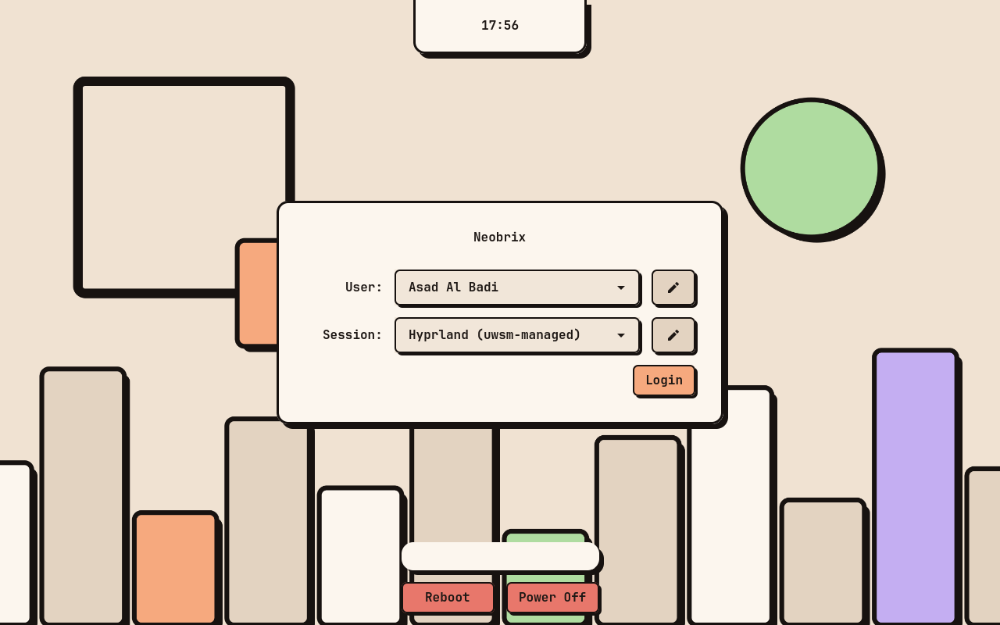 | 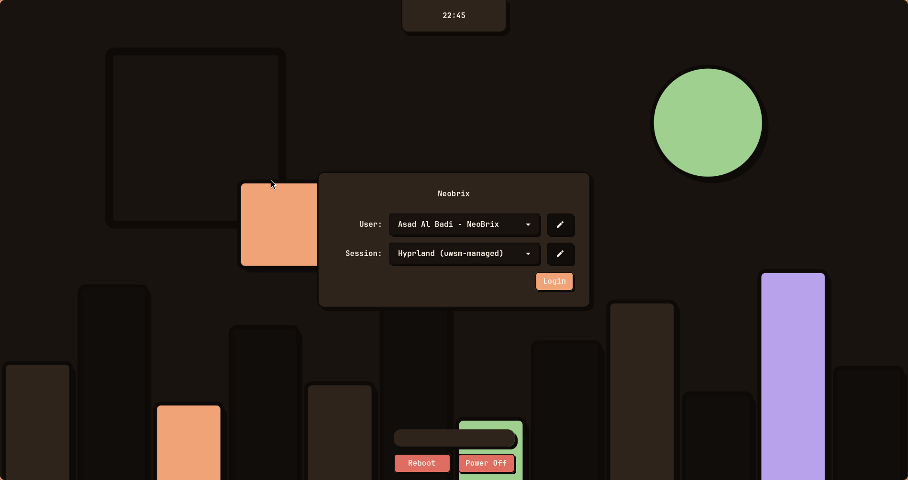 |
| **Login screen** — greetd + ReGreet, themed from the palette | the same greeter in the `dusk` palette |
| 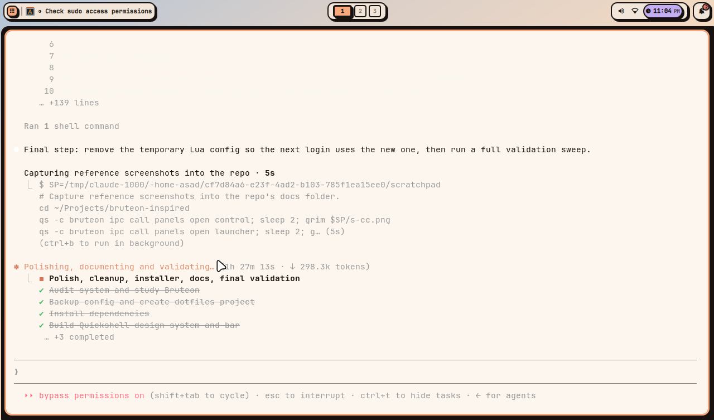 | 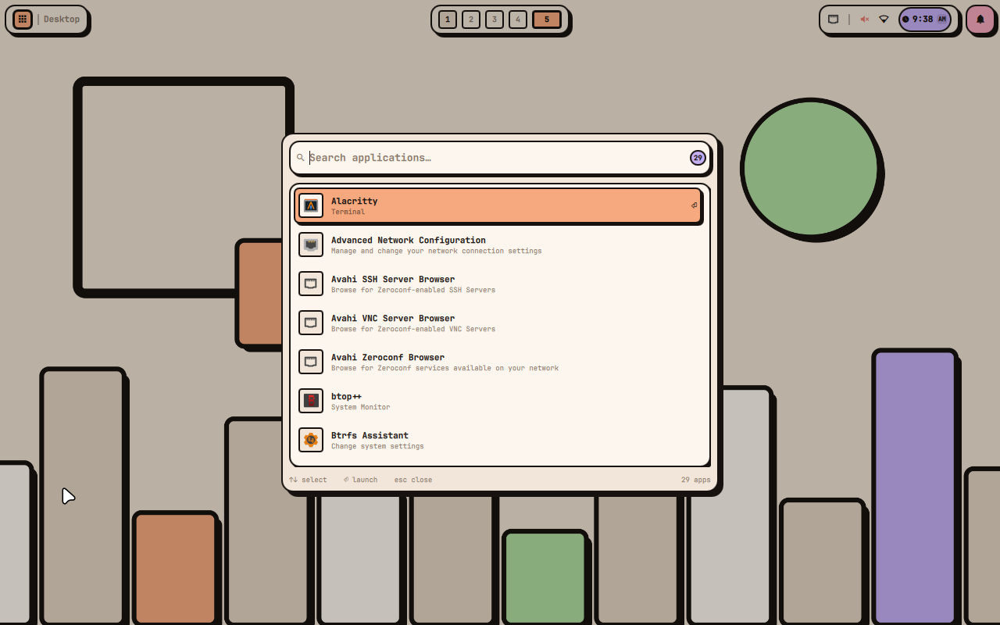 |
| **Desktop** — bar and generated wallpaper | **Launcher** — fuzzy search over `.desktop` entries |
| 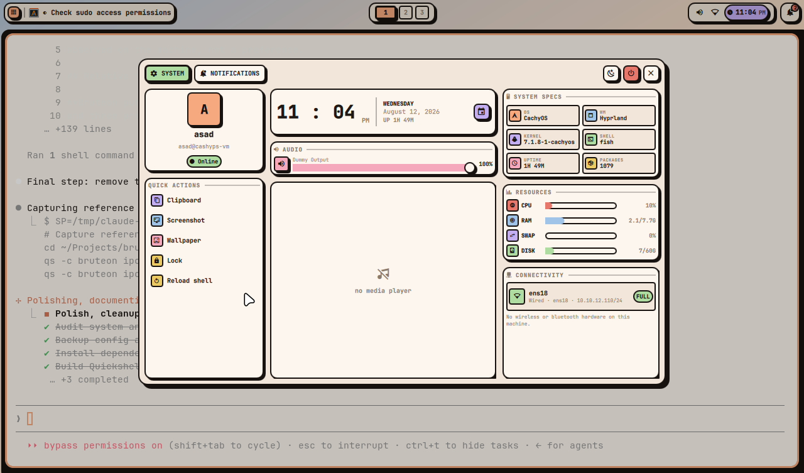 | 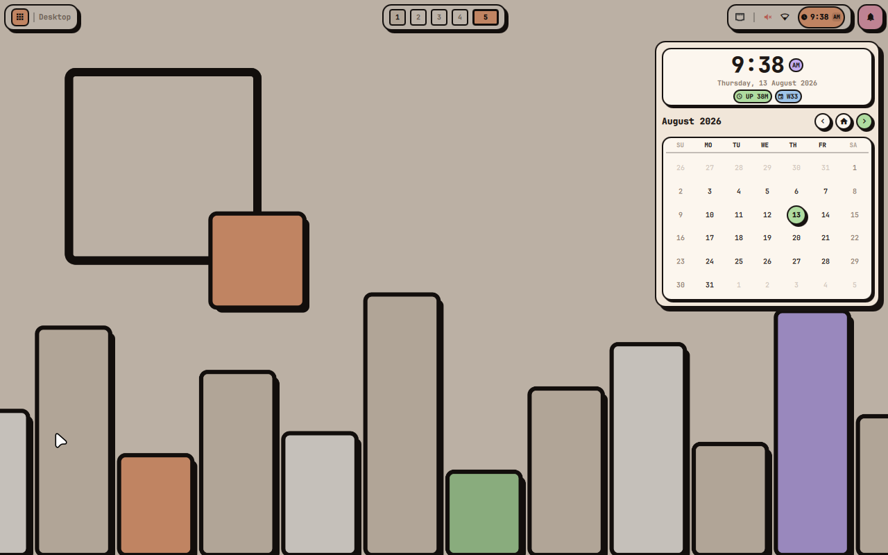 |
| **Control center** — audio, media, specs, resources; connectivity is its own tab | **Calendar** — clock, date, month navigation |
| 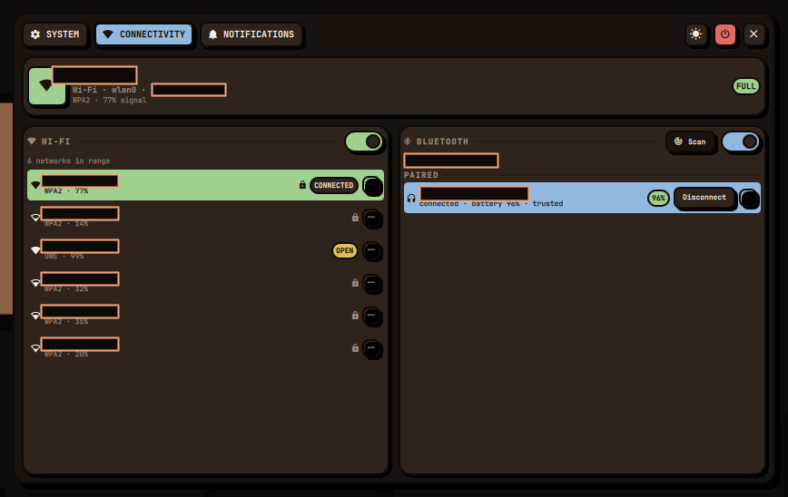 | 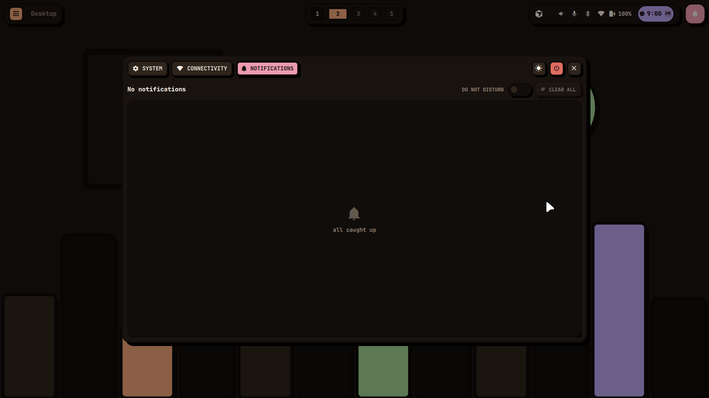 |
| **Connectivity** — wired link, Wi-Fi and Bluetooth. Joining a secured network opens a passphrase field in the row, as shown. Network names and the address are covered by blocks in this screenshot, not by the shell | **Notification centre** — history, do-not-disturb, clear all |
| 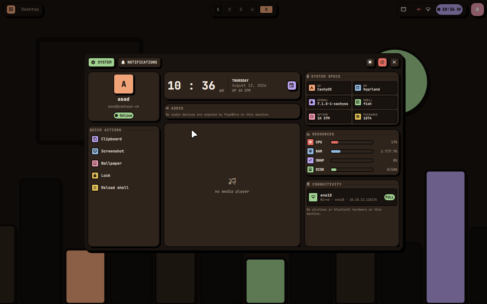 | 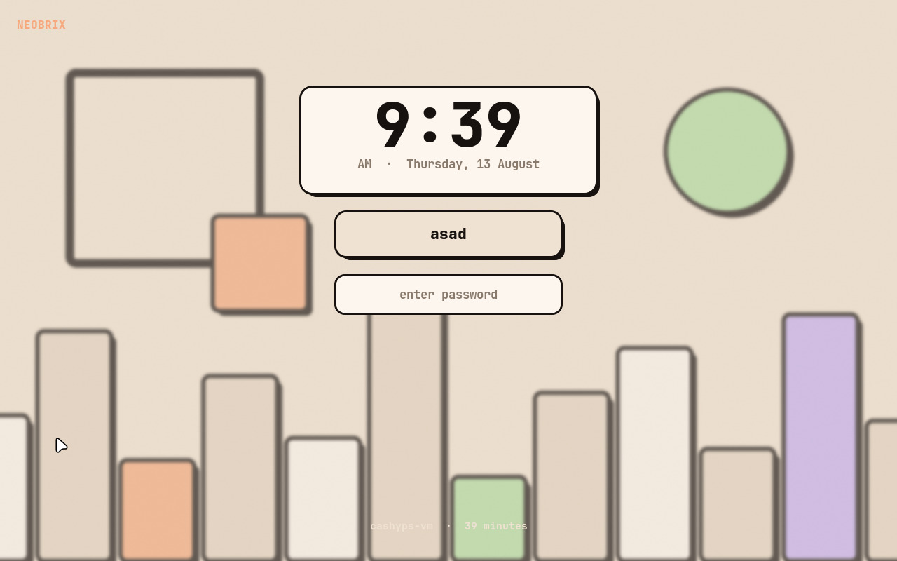 |
| **Neobrix Dark** — the same panel in the `dusk` palette | **Lock screen** — hyprlock, themed from the same palette |
| 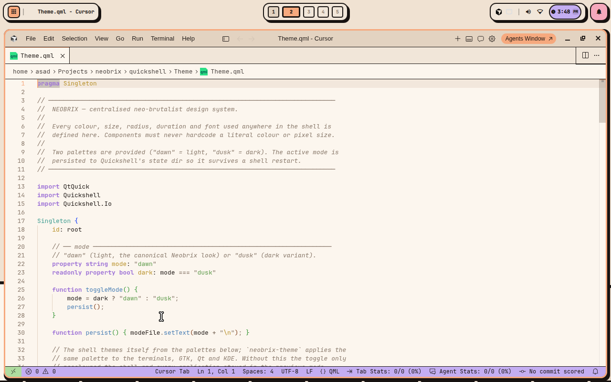 | 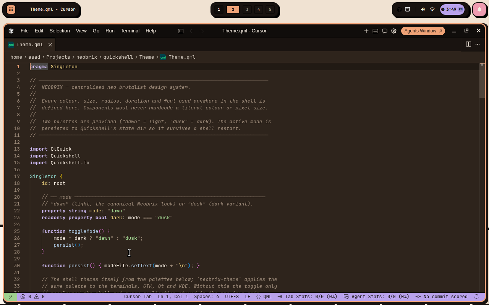 |
| **Cursor** in `dawn` — the editor theme is generated from the same palette | **Cursor** in `dusk` — switching the desktop palette switches the editor |
| 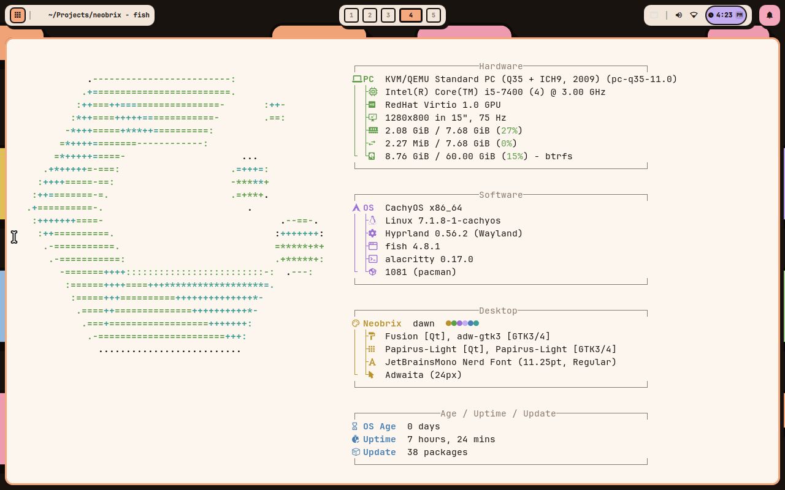 | 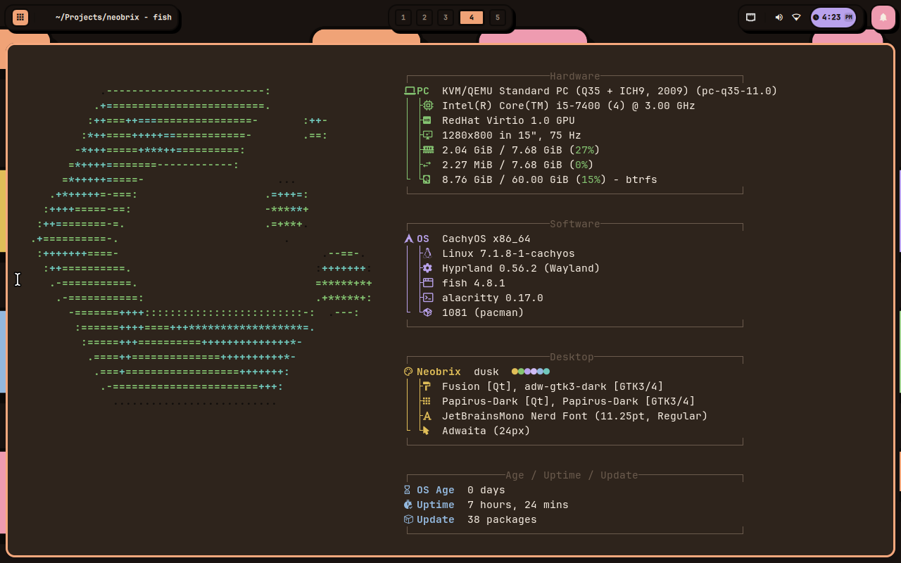 |
| **Terminal greeting** in `dawn` — grouped `fastfetch` readout | the same greeting in `dusk`, recoloured by the terminal palette |

## Architecture

```
greetd
  └── uwsm  ──────────────────────────────► systemd --user
        └── Hyprland (hyprland.lua, Lua config)   │
              │  layer surfaces                   ├── neobrix-shell.service   (qs -c neobrix)
              │                                   ├── hypridle.service
              └── Quickshell ──────────────┐      ├── hyprpolkitagent.service
                    ├── Wallpaper          │      └── cliphist.service
                    ├── Bar (per monitor)  │
                    ├── Launcher           │   all WantedBy=graphical-session.target,
                    ├── Control center     │   grouped by neobrix-session.target
                    ├── Calendar           │
                    ├── Session menu       │
                    ├── Clipboard          │
                    ├── Notifications      │
                    └── Level OSD          │
                                           │
        native integrations ───────────────┘
        Hyprland IPC · PipeWire · MPRIS · NetworkManager · BlueZ ·
        StatusNotifier/DBusMenu · UPower · org.freedesktop.Notifications
```

Nothing polls a CLI tool in a loop. `hyprctl`, `pactl`, `nmcli` and `playerctl`
are never used for state; `/proc` is read via watched file views on a slow tick
and only while a panel is open.

### Quickshell layout

```
quickshell/
├── shell.qml            entry point; warms the service singletons
├── Theme/Theme.qml      the entire design system (palettes, metrics, motion)
├── Components/          BrixCard · BrixButton · BrixIconButton · BrixChip
│                        BrixSlider · BrixVSlider · BrixToggle · BrixProgress
│                        BrixPopup · BrixTooltip · SectionHeader
├── Services/            Hw · SysInfo · Audio · Net · Bt · Backlight · Media
│                        Notifs · Apps · Clip · Session · Wall · Panels
├── Bar/                 Bar · Workspaces · ActiveWindow · Tray · TrayMenu
│                        Indicators · MediaPill · ClockPill · NotifButton
├── Launcher/            Launcher · AppEntry
├── Panels/              ControlCenter · SystemTab · ConnectivityTab
│                        AudioCard · SpecsCard · ResourcesCard · MediaCard
│                        NotificationCenter · CalendarPanel · SessionPanel
│                        ClipboardPanel
├── Notifications/       NotificationLayer · NotificationItem · Osd
└── Wallpaper/           Wallpaper
```

### Hyprland configuration

Hyprland is configured in **Lua** (`~/.config/hypr/hyprland.lua`), not hyprlang
`.conf`. Hyprland 0.56 loads the Lua file in preference and calls the `.conf`
tree the *"legacy config"*; the stub it generates when it finds nothing points
users at the upstream Lua example. **Hyprland ≥ 0.55 is required** — the
installer refuses to deploy on older versions.

```
hypr/
├── hyprland.lua        composes the modules
├── lib/                context (apps, palette, probed capabilities) + helpers
├── config/             monitors · appearance · animations · layouts · input
│                       workspaces · rules · binds · autostart · environment
└── machine/local.lua   per-host overrides, untracked, applied last
```

Workspace/direction/media bindings are generated from tables, touchpad and
brightness settings only exist when that hardware does, and panel shortcuts use
`hl.dsp.global` so no process is spawned per keypress. Validate any edit with
`Hyprland --verify-config -c ~/.config/hypr/hyprland.lua` before logging out.

Full details, the discovered Lua API, and how to debug a Lua config error:
**[docs/HYPRLAND-LUA.md](docs/HYPRLAND-LUA.md)**.

### Theme architecture

`Theme.qml` is the only place a colour or a pixel value is defined. Two palettes —
**Neobrix Light** (`dawn`) and **Neobrix Dark** (`dusk`) — expose an identical
set of roles, and every component reads flat aliases (`Theme.surface`,
`Theme.primary`, `Theme.radiusMd`, `Theme.shadowSm`, `Theme.durFast`…). Switching
mode re-colours the whole shell live; the choice is persisted under
`$XDG_STATE_HOME/quickshell/…/theme-mode`.

`Theme.textOn(accent)` returns a readable glyph colour for an arbitrary accent, so
badges stay legible when the neutral accents invert between palettes.

The mode is not shell-only: changing it runs **`neobrix-theme`**, which renders the
same palette into the terminals, GTK 3/4, qt5ct/qt6ct, kdeglobals, hyprlock and
the editor (Cursor / VS Code, as a real theme extension so both variants stay
selectable from the editor's own picker) and Zen Browser (prefs plus
userChrome/userContent in the profile).

Syntax colours in the editor theme come from the palette's ANSI ramp rather than
its accents — the accents are pastels meant to be card fills with dark text on
top, and as token foregrounds on a cream editor they wash out. The ramp carries a
darkened set for light backgrounds and a lifted set for dark ones, which is
exactly this problem. Note that Cursor has no QML grammar built in; install
`theqtcompany.qt-qml` for highlighting in this project's own source. Alacritty
imports the generated file and watches it, so open terminals recolour live; kitty
reloads on SIGUSR1; GTK follows the gsettings `color-scheme`; Qt/KDE applications
read their palette at startup and so follow on next launch. Those files are
generated into `~/.config` rather than symlinked from this repo, because KDE apps
write to `kdeglobals` themselves.

Dark mode is a designed palette, not an inversion. `dusk` keeps the warm cast of
the light theme (surfaces run brown-black rather than neutral grey), flips the
outline to cream so the chunky borders stay the strongest line on screen, and
desaturates the accents just enough to sit on a dark ground without glowing.
`Theme.textOn()` exists precisely because the neutral accents swap luminance
between the two palettes, so a fixed "text on accent" colour would vanish in one
of them.

### Login screen

The greeter is [ReGreet](https://github.com/rharish101/ReGreet) — GTK4, hosted in
`cage`, driven by greetd — themed from the palette by
`neobrix-generate-greeter`. It replaces the CachyOS default
(`noctalia-greeter-session`), which was the last piece of the boot chain not
following Neobrix.

```
greetd → cage → regreet   (/etc/greetd/config.toml)
                 ├── regreet.toml   config + wallpaper
                 └── regreet.css    the Neobrix stylesheet
```

Run it with sudo, since it writes to `/etc/greetd`:

```bash
sudo neobrix-generate-greeter [dawn|dusk]
```

With no argument it reads the persisted palette. This is the one piece of theming
**not** regenerated on a palette switch — `/etc` is not writable by the user-level
`neobrix-theme`, so the mode is baked in and changing it means re-running the
script.

`./install/deploy.sh --greeter` does the same thing as part of a deploy, plus it
writes `RECOVERY` and both greetd configs into `/etc/greetd`. It **stages** only:
`config.toml` is never replaced and `greetd` is never enabled. Every other part of
`deploy.sh` stays inside `$HOME` and needs no root; this is the one flag that
calls `sudo`.

Activating and reversing it is one command each — the installer calls exactly the
same code, so there is one implementation of the risky part:

```bash
neobrix greeter status      # what is staged, what is active, what the rollback is
neobrix greeter enable      # asks, then activates for the NEXT boot
neobrix greeter disable     # puts the recorded display manager back
```

`enable` refuses rather than half-applying. It needs `greetd`, `regreet` and
`cage` present, `RECOVERY` and the `agreety` fallback already staged, and a getty
reachable on another VT; it only proceeds when a human answers at a terminal, so
no pipe and no flag can trigger it; and it records the display manager it is
replacing **before** disabling anything, which is what `disable` and
`install/uninstall.sh` read to put things back. Neither restarts anything —
greetd taking over mid-session would end that session — so both take effect at
the next boot.

Preview the greeter itself any time, without touching greetd:

```bash
regreet --demo -c /etc/greetd/regreet.toml -s /etc/greetd/regreet.css
```

The wallpaper is copied to `/usr/share/backgrounds/neobrix/` because the greeter
runs as the `greeter` user and cannot read `$HOME`.

ReGreet builds its UI in code rather than from a template, so there are no custom
CSS classes to target — the stylesheet styles generic GTK4 selectors (`window`,
`frame`, `entry`, `button`). The card uses a heavier outline and deeper shadow
than the in-shell equivalent: in the shell a card sits on a panel and fill
contrast carries the edge, but here it floats on a wallpaper where a near-black
2px border on a dark card disappears.

**Iterate safely with `--demo`.** ReGreet renders its real UI without greetd, so
the greeter can be developed without ever risking the ability to log in:

```bash
regreet --demo -c /etc/greetd/regreet.toml -s /etc/greetd/regreet.css
```

If the greeter ever fails to come up, roll back from a TTY or the hypervisor
console — the previous config is kept beside it:

```bash
sudo cp /etc/greetd/config.toml.pre-regreet /etc/greetd/config.toml
sudo systemctl restart greetd
```

### Zen Browser

`neobrix-generate-zen-theme` writes into the Zen profile — not a symlink from the
repo, because the profile directory name is machine-specific and Zen rewrites
`prefs.js` itself. Three levers, in order of how well they survive a Zen update:

* **`user.js`** — Zen's own `zen.theme.accent-color`, plus the light/dark scheme
  (`layout.css.prefers-color-scheme.content-override`, `browser.theme.*`). These
  are supported settings.
* **`chrome/neobrix.css`** — the browser UI, imported from `userChrome.css` so
  anything you add yourself is preserved. Everything is written inside a
  `neobrix:begin/end` block, so the generator never clobbers your own rules.
* **`chrome/userContent.css`** — internal pages, so a new tab is not a white flash
  in dusk.

Two details worth knowing, both found by unpacking `browser/omni.ja` rather than
guessing at selectors:

* The vertical tab sidebar is painted by **`--zen-main-browser-background`** and
  its `-toolbar` variant. Setting only the `--zen-colors-*` family leaves it
  untouched.
* Popup borders are **not** on `menupopup`/`panel` — Firefox draws them on the
  shadow-DOM `::part(content)` as `1px solid var(--panel-border-color)`. Styling
  the host element only ever yields the thin default outline; the chunky border
  has to go on `::part(content)`.

**Zen must be restarted** for the chrome stylesheets to load. `neobrix-theme`
regenerates them on a palette switch, but the running browser keeps the old ones
until it restarts.

### Dark Reader

Dark Reader keeps its configuration in extension storage (IndexedDB inside the
browser profile) and has no managed-storage support, so nothing can push settings
into it from outside. `neobrix-generate-darkreader` therefore produces two files
to feed it by hand, both from the same palette:

| file | where it goes | needed? |
|---|---|---|
| `darkreader-neobrix.json` | Settings → Manage Settings → **Import Settings** | yes — this is the whole thing |
| `darkreader-dynamic-fixes.txt` | Dev Tools → **Edit dynamic theme fixes** | optional extra |

Both are committed under [`theming/darkreader/`](theming/darkreader) so they can
be used on their own, in any browser Dark Reader supports, without deploying the
rest of Neobrix — see that directory's
[README](theming/darkreader/README.md) for step-by-step import instructions.
`neobrix-theme` also writes a live copy to `$XDG_DATA_HOME/neobrix/`.

**Importing the JSON is sufficient** — verified in practice; the dynamic fixes are
optional polish, not a second half of the setup.

The settings file carries **both** colour schemes, so one import covers dawn and
dusk, and sets `automation.mode = "system"`. Two things make "system" mean
Neobrix: `neobrix-theme` already sets the desktop's `color-scheme` through
gsettings/the portal, which is what Firefox derives system dark mode from, and
`neobrix-generate-zen-theme` additionally pins `ui.systemUsesDarkTheme` as a
belt-and-braces override for cases where the portal is not consulted. Either way
Dark Reader flips with a dawn/dusk toggle and never needs re-importing.

The dynamic fixes are optional. They add what the scheme colours cannot:
`accent-color` for native checkboxes/radios/ranges, the `::selection` colours,
scrollbar tones and the focus ring — worth pasting if you want the peach accent
inside form controls, but the import alone already reads as Neobrix. Colours there are wrapped in Dark Reader's `${...}` syntax, which
means "adapt this colour to the active theme" — that is what makes one block
correct in both schemes rather than pinning it to one. It is deliberately
restrained, because the block applies to every site: only properties that cannot
break a layout.

When pasting the fixes, add them at the **top** of the Dev Tools box followed by a
`====` separator line and keep everything below. Replacing the whole box discards
every built-in site fix Dark Reader ships.

### Terminal greeting

`fish_greeting` runs `fastfetch`, configured by `terminal/fastfetch/config.jsonc`
into four boxed groups — Hardware, Software, Desktop, Age/Uptime/Update — with
tree-style keys and one colour per group, rather than a single flat list. The
distro logo is left on auto-detect, so it stays whatever the distribution ships.
The layout grammar is modelled on [Omarchy](https://omarchy.org)'s fastfetch
config; the modules, icons, colours and commands are Neobrix's own.

Group colours are ANSI *names*, not hex. Because `neobrix-theme` generates the
terminal palette from the same source as the shell, `green` in that file **is**
Neobrix pistachio — so the whole readout follows a dawn/dusk switch without the
config knowing anything about the palette. The same applies to the `Neobrix`
row's colour dots, and it is why an already-printed greeting recolours in place
when the mode changes.

Regenerate with **`neobrix-generate-fastfetch`** rather than editing the JSON by
hand. The Nerd Font icons are Private-Use codepoints that do not survive being
copied around — authoring the file by hand silently dropped ten of them, leaving
bare tree connectors — so the generator writes them by codepoint.

The neo-brutalist signature lives in **`BrixCard`**: a flat fill, a chunky outline,
and a hard offset shadow drawn as a negative-z child (Qt Quick paints those behind
the parent). Every surface in the shell — bar islands, panels, chips, buttons,
sliders, notification cards — is a `BrixCard`, which is why they all share the
same physics: press a button and it travels into its own shadow.

## Dependencies

Everything is in the CachyOS/Arch repositories — no AUR helper required.

```bash
./install/packages.sh --list     # see the full list
./install/packages.sh            # install what's missing
```

Core: `hyprland` `quickshell` `hyprlock` `hypridle` `hyprpolkitagent` `hyprpicker`
`uwsm`.
Services: `pipewire` `pipewire-pulse` `wireplumber` `networkmanager` `bluez`
`bluez-utils` `bluez-tools` (`bt-agent`, without which Bluetooth pairing cannot
bond) `xdg-desktop-portal{,-hyprland,-gtk}` `polkit` `power-profiles-daemon`.
Utilities: `wl-clipboard` `cliphist` `grim` `slurp` `satty` `brightnessctl`
`libnotify` `imagemagick` `librsvg` `python`.
Look: `ttf-jetbrains-mono-nerd` `papirus-icon-theme` `adw-gtk-theme` `qt5ct`
`qt6ct` `adwaita-cursors`.
Apps: `alacritty` `dolphin`.
Optional, not in Arch's official repositories: `zen-browser-bin` `cursor-bin`
(both in the `cachyos` repo; AUR on plain Arch). Skipped automatically when
unavailable — the browser and IDE keybinds simply point at what you do have.

## Manual installation

The [one-liner](#install) does exactly this, with the conflict and greeter
questions wrapped around it. Doing it by hand is equivalent, and lets you run the
`--dry-run` first:

```bash
git clone https://github.com/asad-albadi/NeoBrix.git ~/Projects/neobrix
cd ~/Projects/neobrix
./install/packages.sh
./install/deploy.sh --dry-run     # inspect first
./install/deploy.sh
./install/deploy.sh --greeter     # optional: also stage the login screen (sudo)
```

Run these from the repository root — the paths are relative, and a shell will
simply report `./install/deploy.sh` as an unknown command from anywhere else.

`deploy.sh` symlinks the repo into `~/.config`, so editing the repo edits the live
configuration — there is never a divergent second copy. Anything it replaces is
copied to `~/.config-backup/deploy-<timestamp>/` first. It also links
`scripts/*` into `~/.local/bin`, installs and enables the systemd user units,
generates the wallpapers, points the XDG browser handlers at Zen, and themes Zen
itself — the last of these is skipped with a note if Zen has never been started,
since the profile it writes into does not exist until then. The login screen is
the one thing it leaves alone unless asked: see [`--greeter`](#login-screen).

Then log out and back in. To apply most of it without logging out:

```bash
hyprctl reload
systemctl --user restart neobrix-session.target
```

To reverse a deployment — units disabled, symlinks removed, the newest
`~/.config-backup/deploy-*` restored, and a printed list of what it deliberately
left behind:

```bash
./install/uninstall.sh
```

## Updating

```bash
cd ~/Projects/neobrix && git pull
./install/deploy.sh                       # re-link anything new
systemctl --user restart neobrix-shell    # pick up QML changes
hyprctl reload                            # pick up hyprland.conf changes
```

Always validate compositor edits before logging out — a bad config means a
session that will not start:

```bash
Hyprland --verify-config -c ~/.config/hypr/hyprland.lua
```

`--verify-config` executes the Lua, so it catches undefined dispatchers and
runtime errors, not just syntax. If a config error stops any bind from
registering, Hyprland falls back to emergency binds (`SUPER + Q` only).

## Keybindings

Full list: [docs/KEYBINDINGS.md](docs/KEYBINDINGS.md). The essentials:

| Keys | Action |
|---|---|
| `Super` + `Space` / `Super`+`D` | application launcher |
| `Super` + `X` | control center |
| `Super` + `A` | notification centre |
| `Super` + `C` | calendar |
| `Super` + `V` | clipboard history |
| `Super` + `Escape` | session menu (reboot/shutdown need a second click) |
| `Super` + `Return` | terminal |
| `Super` + `E` / `W` | file manager / browser |
| `Super` + `Q` / `F` | close / fullscreen |
| `Super` + `1…0` | workspace (`+Shift` moves the window) |
| `Super` + `S` | scratchpad |
| `Print` / `Shift`+`Print` / `Super`+`Print` | screenshot region / screen / window |
| `Super` + `Shift` + `T` | toggle light/dark |
| `Super` + `Backspace` | lock |

## Scripts

| Command | Purpose |
|---|---|
| `neobrix reload\|restart\|check\|status\|logs\|theme` | session helper: reload Hyprland, restart the shell, verify the deployment, inspect state |
| `neobrix greeter status\|enable\|disable` | login screen: inspect, activate (asks first), or restore the display manager it replaced |
| `neobrix-screenshot region\|screen\|window\|edit` | capture → file + clipboard + notification |
| `neobrix-wallpaper apply\|next\|prev\|theme\|list\|generate` | wallpaper selection |
| `neobrix-generate-wallpapers [dir] [WxH]` | regenerate the built-in set |
| `neobrix-theme dawn\|dusk\|current` | apply the palette to terminals, GTK, Qt and KDE |

The shell is also scriptable:

```bash
qs -c neobrix ipc call panels toggle launcher
qs -c neobrix ipc call panels control system
qs -c neobrix ipc call panels control connectivity
qs -c neobrix ipc call panels control notifications
qs -c neobrix ipc call theme set dusk
qs -c neobrix ipc call wallpaper next
```

## VM notes

Developed and validated on a Proxmox/KVM guest with virtio-gpu, which shaped a few
decisions:

* **No battery, backlight, Bluetooth adapter, Wi-Fi or temperature sensors.** Every
  such widget is gated on a probe in `Services/Hw.qml` and simply does not exist
  when the hardware does not. Nothing renders as a dead control.
* **No emulated sound card.** PipeWire exposes only a "Dummy Output"; the volume
  UI drives it correctly, and the microphone row is absent because there is no
  capture device.
* **Software rendering.** Mesa falls back to `kms_swrast`/llvmpipe, so the shell's
  ~360 MB PSS is mostly the software rasteriser (≈290 MB of it is anonymous
  llvmpipe/LLVM memory). Idle CPU is 0 %. Blur is disabled and animations are short,
  which suits the rasteriser — though both are design choices first, and stay that
  way on real hardware (see [Physical-machine notes](#physical-machine-notes)).
* **No wallpaper daemon.** hyprpaper never registers a wallpaper target here, so
  the shell draws the wallpaper itself.
* **hyprlock cannot screenshot itself.** Screencopy needs a DRM dumb buffer the
  guest denies, so the lock background is a maintained copy of the wallpaper.

## Physical-machine notes

The dotfiles are written to run unchanged on real hardware:

* Battery, backlight, Bluetooth and Wi-Fi sections appear automatically once the
  devices exist — there is no VM-specific branch to remove.
* Put monitor layouts and per-host tweaks in `~/.config/hypr/machine/local.lua`
  (untracked, seeded by the installer). Example:
  ```lua
  return function(ctx)
      hl.monitor({ output = "DP-1", mode = "2560x1440@165", position = "0x0", scale = 1 })
      hl.config({ decoration = { blur = { enabled = true, size = 4, passes = 2 } } })
  end
  ```
* Touchpad settings, gestures and brightness keys appear automatically once that
  hardware exists — the config probes for it rather than assuming.
* **Wi-Fi and Bluetooth are both driven from the connectivity tab**, with no
  terminal step. Clicking a secured network with no saved profile opens a
  passphrase field in the row itself and hands what you type to
  `WifiNetwork.connectWithPsk()`; a saved network connects straight away, because
  NetworkManager already holds its secret. Failures report NetworkManager's own
  reason in the row — a wrong passphrase reads *"Secrets were required but not
  provided"* rather than failing silently. Per-network connect, disconnect and
  forget live behind the row's `…` button.

  The passphrase is never written anywhere, never logged, and never passed
  through a shell: it goes from the field to NetworkManager over D-Bus and the
  field is cleared the moment it is submitted.

  Bluetooth scans, pairs, connects, trusts, forgets and reports battery from the
  same tab. Discovery is opt-in and stops when you leave the tab, so a scan never
  runs on battery in the background.

  **Pairing needs a BlueZ agent, and Neobrix ships one.** BlueZ will not bond
  without an agent: with none, a device pairs, works for seconds and is
  forgotten, because the link key is never stored.
  `neobrix-bt-agent.service` (`bt-agent`, from `bluez-tools`) fills that role and
  is enabled by `deploy.sh`; the unit is skipped automatically on a machine with
  no adapter.

  **Read this before deploying it elsewhere:** the agent runs with
  `NoInputNoOutput`, which means Just Works pairing — it accepts without showing
  a code to compare, so pairing carries **no MITM protection**. What keeps that
  safe is the adapter staying `Pairable=false`, which makes BlueZ refuse pairing
  requests you did not start; the only bond the agent can accept is one you
  initiated from the panel moments earlier. If you make the adapter pairable or
  discoverable, you remove that mitigation. The reasoning, the HCI evidence and
  the alternative are in [docs/DEVIATIONS.md](docs/DEVIATIONS.md).
* Closing the lid is handled by logind, not by this config, and hypridle's
  `before_sleep_cmd = loginctl lock-session` means the session locks before it
  suspends.
* `hypridle` never suspends by default; add a suspend listener locally if you want
  one.

Three tracked defaults were chosen for a software-rendered guest rather than on
merit. They are safe everywhere, but real hardware can do better — override them in
`machine/local.lua`:

| Setting | Tracked value | Why, and what to consider on real hardware |
|---|---|---|
| `render.direct_scanout` | `0` | Off because a virtualised GPU can present blank frames. Setting `1` on real hardware is unlikely to change much on its own: as `hypr/config/appearance.lua:137` notes, the shell's layer surfaces block scanout anyway. |
| `decoration.blur.enabled` | `false` | Primarily a design choice — brutalism is flat — but also a cost the software rasteriser cannot absorb. Enable it locally if you want it. |
| `input.accel_profile` | `"flat"` | Predictable for a SPICE/virtio pointer, and what CachyOS set. Note this is the **global** pointer setting (`hypr/config/input.lua:15`) and applies to every pointer — the `touchpad` block has no `accel_profile` of its own. To give a touchpad a different profile, add a per-device section rather than changing this value. |

Animation speeds are *not* in that list. They are short for two reasons that happen
to agree — brutalism snaps, and short animations are cheap for a software rasteriser
(`hypr/config/animations.lua:3`) — so they are a design choice that suits the VM
rather than a concession to it. Leave them as they are on real hardware.

## Troubleshooting

| Symptom | Check |
|---|---|
| No bar | `systemctl --user status neobrix-shell` · `journalctl --user -u neobrix-shell -n 50` |
| Bar but no panels | `qs -c neobrix ipc call panels state` — if that errors the shell isn't running |
| Keybinds do nothing | `hyprctl globalshortcuts` should list `neobrix:*`; if empty the shell isn't up |
| Session won't start after an edit | `Hyprland --verify-config -c ~/.config/hypr/hyprland.lua` |
| Only `SUPER+Q` works | a Lua error stopped binds registering — Hyprland's emergency mode; check `hyprctl configerrors` |
| `hyprctl dispatch "workspace 2"` errors | under a Lua config the argument is Lua: `hyprctl dispatch 'hl.dispatch(hl.dsp.focus({workspace=2}))'` |
| Stuck on "lockscreen app died" | `hyprctl eval 'hl.clear_crashed_lockscreen()'` (Lua config) or `hyprctl dispatch clearcrashedlockscreen` |
| Notifications not appearing | only one daemon may own the bus: `busctl --user list \| grep Notifications` |
| No wallpaper | `neobrix-wallpaper current` · `neobrix-wallpaper generate` |
| Qt apps unstyled | `QT_QPA_PLATFORMTHEME=qt6ct` in `~/.config/uwsm/env`, and `qt6ct` config linked |

## Restoring the previous configuration

Two independent safety nets:

```bash
# 1. everything deploy.sh replaced, newest backup first
./install/deploy.sh --restore

# 2. the working hyprlang config from just before the Lua migration
ls ~/.config-backup/pre-lua-migration/

# 3. the untouched pre-Neobrix CachyOS configuration
ls ~/.config-backup/pre-neobrix/
cp -a ~/.config-backup/pre-neobrix/hypr/hyprland.lua ~/.config/hypr/
cp -a ~/.config-backup/pre-neobrix/hypr/config      ~/.config/hypr/
systemctl --user disable --now neobrix-shell.service
```

`~/.config-backup/pre-neobrix/` also contains the original package list and
environment for reference. Neither backup is ever deleted by the installer.

## Project structure

```
neobrix/
├── hypr/                  Hyprland configuration (Lua)
│   ├── hyprland.lua       entry point
│   ├── config/            monitors, input, appearance, animations, layouts,
│   │                      workspaces, rules, binds, autostart, environment
│   ├── lib/               context + helpers shared by the config modules
│   ├── machine/           per-host overrides (untracked; seeded from .example)
│   ├── hyprlock.conf      hyprlock still uses hyprlang — see below
│   ├── hypridle.conf
│   └── xdph.conf
├── quickshell/            the shell itself
│   ├── shell.qml          entry point
│   ├── Theme/             the design system — single source of every value
│   ├── Components/        Brix* primitives
│   ├── Bar/               bar and its islands
│   ├── Launcher/
│   ├── Panels/            control center, calendar, session, clipboard
│   ├── Notifications/     toasts, history, level OSD
│   ├── Services/          singletons wrapping the native integrations
│   └── Wallpaper/
├── terminal/              alacritty, kitty, fastfetch
├── theming/darkreader/    importable Dark Reader config (generated)
├── greeter/               login screen: regreet css/toml + greetd config
├── scripts/               neobrix, -theme, -wallpaper, -screenshot,
│                          -generate-{wallpapers,identity,fastfetch,
│                                     editor-theme,zen-theme,darkreader}
│   └── lib/palette.sh     the palette, shared by every generator
├── systemd/               user units
├── uwsm/env               session environment
├── install/               deploy.sh, packages.sh
└── docs/
```

QML directories are capitalised because that is how QML resolves module
imports (`import qs.Components`); the rest is lowercase. Only `hyprland.lua`
uses the Lua format — hyprlock, hypridle and xdg-desktop-portal-hyprland still
expect hyprlang `.conf`, and are left in their own supported formats rather
than converted for the sake of uniformity.

## Built on

* **[Quickshell](https://quickshell.org)** — the toolkit the entire shell is
  built on, and the reason none of this needs Waybar, Rofi, Mako or swaync.
* **[Hyprland](https://hypr.land)** — the compositor, and the Lua configuration
  format this project targets.

Neo-brutalism as an interface style is a broad movement rather than any one
project's invention; the palette, geometry and components here are original to
Neobrix. [docs/DEVIATIONS.md](docs/DEVIATIONS.md) records the design decisions
and why each was made.

## Licence

MIT — see [LICENSE](LICENSE).

The wallpapers are original artwork generated by
`scripts/neobrix-generate-wallpapers` from the theme palette, so the repository
carries no third-party image licensing. No code or assets from any other project
are redistributed here.
